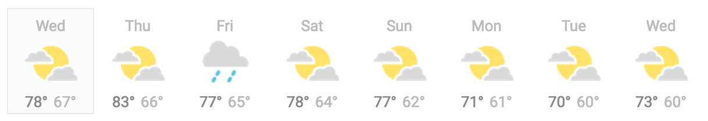

# About

The point of this exercise is to give you the chance to show us what you know, can do and how you approach problem solving.

For this exercise to be useful, we can't have solutions from the internet. This should go without saying, but please do not distribute or share this exercise to anyone in any form.

When you feel you're ready, please email us your solution and how we can run it. **In your email you must include that this is your original work and was completed only by you.**

# Instructions

This exercise comes in three parts. In the first two parts, you will code on your own time. In the second part, we will ask you to come in and debug a similar code.

# Part I
## Weather APP
In this part, we want to have a Weather APP that uses data from the [Weather API](https://openweathermap.org/). Two account profiles will be needed in the APP:

1. Admin: This account can connect to the APP, create, edit and remove cities which we're interested in knowing the weather. For each city he can display a 5-day weather forecast (from the API), where each day shows the high and low temperatures, and an image for sunny/rainy/cloudy/snowy. It should look like the following:

The admin can also can also click on a day, and see its hourly forecast.

2. Regular user: This account can log in the APP. He must also be able to edit his profile and select a city in which he is (the list of cities available must come from the list setup by the admin). The user can then see a 5-day weather forecast of the city he is in. He should also be able to click on a day an see its hourly forecast.

`NB.`
- You may hard code the users in a file or use the `LocalStorage` to save the data. An actual database is not required.
- The weather data must come from the Weather API.

# Part II
## Create an image ad
dipp's mission is to rid the internet from irrelevant ads by using the power of Artificial Intelligence.
Based on the metadata provided in the file `./src/metadata.json` by our AI ie our Backend, you will have two tasks:
1. Parse the file `./src/metadata.json` and create an image ad using React. You can use HTML but you will have a bonus if you use React components which represent for example the `background, logo ...`.
2. Create a button that enables us to download the final ad as an image. The final ad will look like this:

# Part III
In this part, we will ask you to come in for demo and code review.

# Important notes:

- Feel free to use any library or dependency you want but don't forget to add it in `package.json`
- There is no **right** or **wrong** answer. We are interested in how you approach problem solving.
- A particular attention will be given to how you structure your code and how you create the components.
- Please don't hesitate email us if you have any questions.

Your solution will be evaluated using the following criteria
- Following the requirements
- UI and user experience quality
- Code quality (organization, best practices, idiomatic code, design)

# Good luck !!!
